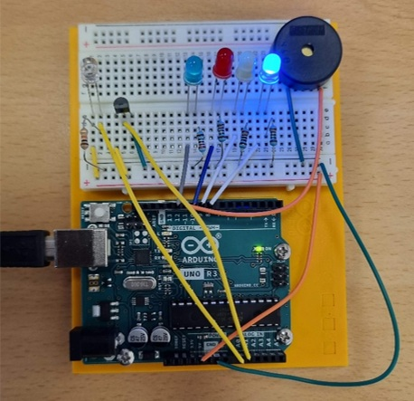
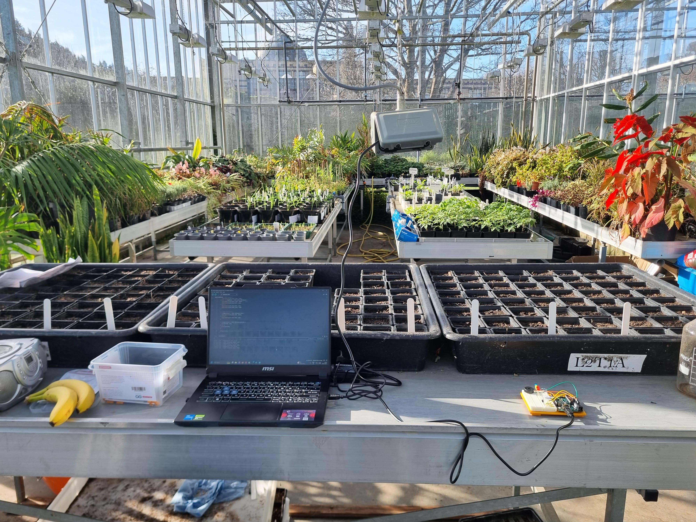
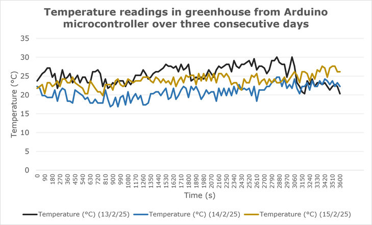
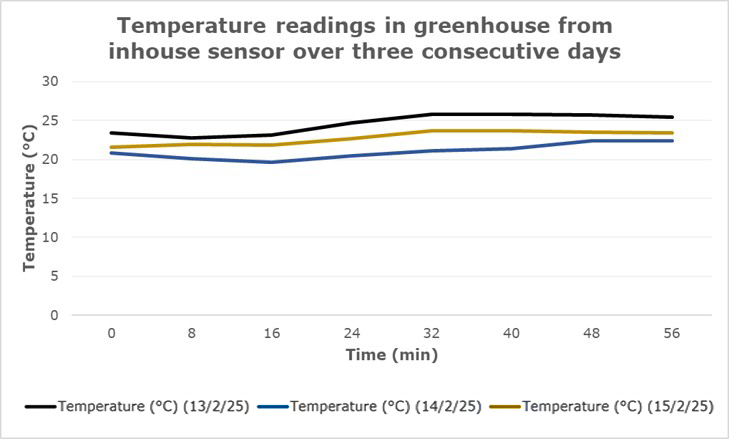
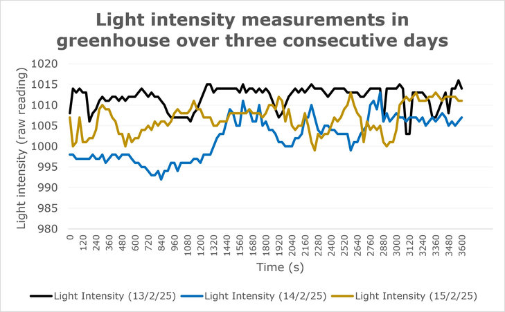
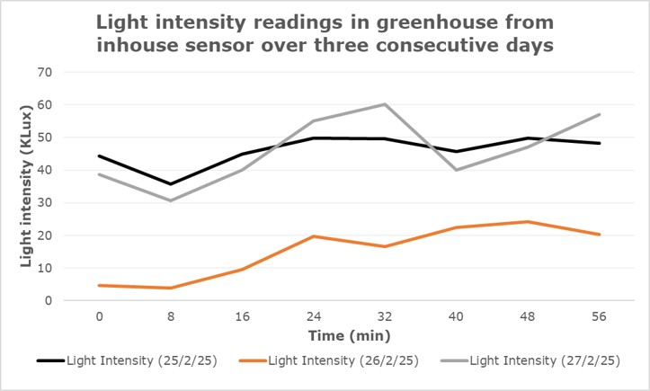

# Arduino-based Greenhouse Microclimate Monitoring

Here, I present a low-cost Arduino UNO system that measures temperature and light intensity inside a greenhouse, which was tested against the greenhouse's calibrated in-house sensors. 

## Overview

Greenhouses consume large amounts of energy, water and agrochemicals. Sensors and automation help monitor the greenhouse microclimate and optimise resource usage. This project explores the usability of an Arduino UNO with temperature sensor and light-dependent resistor (LDR) in a greenhouse, and compares its readings against a calibrated, industrial in-house sensors.

## How it works

The Arduino reads the temperature sensor (pin A1) and the LDR (pin A0) every 30 s and prints both values to the serial monitor (9600 baud). LEDs and a buzzer indicate the current conditions:

| Condition | Indicator |
|---|---|
| Light below 800 (raw) | Blue LED |
| Light above 980 (raw) | Yellow LED |
| Temperature below 20 °C | Blue LED |
| Temperature above 25 °C | Red LED |
| Temperature above 30 °C | Buzzer (500 Hz) |

Light thresholds are raw analog readings (0–1023). Between 20 and 25 °C, which is ambient room temperature, no temperature indicator is switched on. A 0.1 s delay between the two sensor readings prevents them from interfering with each other.

  <p align="center">
    
  </p>

**Figure 1.** Arduino microcontroller designed using the Arduino student kit which was used to measure temperature and light intensity in the greenhouse.

## Repository structure

```
├── arduino/
│   └── greenhouse_light_temp/
│       └── greenhouse_light_temp.ino   Arduino sketch
├── python/
│   ├── log_arduino_data.py             Logs serial output to CSV
│   └── requirements.txt
├── data/
│   └── arduino_readings_2025-02-26.csv Arduino readings, 26 Feb 2025
├── Images/                             Figures used in this README
└── README.md
```

## Getting started

**Arduino.** Open `arduino/greenhouse_light_temp/greenhouse_light_temp.ino` in the Arduino IDE and upload it to an Arduino UNO as in Figure 1.

**Logging data.** Install the dependency and run the logger:

```
pip install -r python/requirements.txt
python python/log_arduino_data.py
```

Before running, set `SERIAL_PORT` in the script to your Arduino's serial port. The script appends the readings with a timestamp to `sensor_data.csv` in the `C:\DataLogs` folder and stops after 122 readings (This was specific to my study; you can set your data collection duration as per your requirement).

## Study design

Data was collected from a greenhouse at the Rosemount Environmental Institute, UCD, Dublin, Ireland. The Arduino was placed on a table in a partially shaded area, away from direct sunlight, and recorded for one hour on each of three days (25, 26 and 27 February 2025) at 30 s intervals. The serial output was recorded on a laptop using the Python script in this repository.

  <p align="center">
    
  </p>

**Figure 2.** Device setup and data collection in the greenhouse. Arduino microcontroller was placed in a partially shaded area of the greenhouse, connected to the laptop, and the Python script was run to record data from the serial monitor.

The Arduino readings were compared with data from sensors already installed in the greenhouse, which logs temperature and light intensity every 8 min. The in-house temperature sensor is a digital DHT-22. Because the LDR readings are raw values, they were converted to klux to match the in-house light meter. As the two systems log at different intervals, only the time points where the in-house sensor recorded data were matched for analysis. The data was analysed in Microsoft Excel, using Pearson's correlation coefficient to assess how similar the Arduino and in-house readings were.

## Results

### Temperature

The highest temperature measured in the greenhouse was 30.1 °C on 25 February (clear and sunny day). The lowest was 16.8 °C on 26 February (overcast day). The temperature on 27 February was consistent.

<p align="center">
    
  </p>

**Figure 3.** Temperature readings from Arduino microcontroller (measured every 30 s) showing the fluctuations in an hour inside the greenhouse over three consecutive days.

<p align="center">
    
  </p>

**Figure 4.** Temperature readings from in-house sensor (measured every 8 min) showing the fluctuations in an hour inside the greenhouse over three consecutive days.

The Arduino temperature readings fluctuated more than those of the in-house sensor, which is a digital DHT-22 that is more accurate and better housed in the sensor console. The large fluctuations in the Arduino readings are also due to the breadboard heating up in sunlight and to cool breezes entering the greenhouse. The temperature readings from the two systems were poorly correlated.

Pearson’s correlation coefficient (r) for temperature readings was 0.43, 0.66, and 0.36 for 25th, 26th, and 27th February, respectively, indicating that the temperature
readings from the two sensors were poorly correlated.

### Light intensity

The light intensity readings were mostly stable on 25 and 27 February. On 26 February they fluctuated slightly because of overcast weather, which later gave way to partly cloudy conditions.

<p align="center">
    
  </p>

**Figure 5.** Light intensity readings from Arduino microcontroller showing the fluctuations in an hour inside the greenhouse over three consecutive days.

<p align="center">
    
  </p>

**Figure 6.** Light intensity readings from the in-house sensor showing the fluctuations in an hour inside the greenhouse over three consecutive days.

The correlation values between the LDR and the in-house sensor varied widely, and most of the values obtained with the Arduino's LDR exceeded 95 klux, which is unrealistic.


## Discussion

**Temperature.** The in-house DHT-22 has a stated accuracy of ±0.5 °C, compared with ±2 °C for the Arduino's temperature sensor. It is pre-calibrated, compensates for non-linearity and temperature drift, has less noise and does not require voltage conversion to determine temperature. The Arduino sensor is low-cost, but its readings were affected by heating in sunlight.

**Light.** The LDR performed poorly: its readings were nowhere close to the in-house light meter. Light meters are usually pre-calibrated, designed to match the sensitivity of the human eye, give a linear output and are stable across temperature ranges. LDRs have a non-linear resistance–light intensity relationship, which makes measuring intensity with them challenging. The LDR would need to be calibrated against a light meter with known values, with the resulting model incorporated in the sketch.

**Practicality in a greenhouse.** The Arduino provides an interactive, low-cost platform to learn and build sensors. However, its bulky design, loose wires and exposed breadboard make it impractical in a greenhouse, because the breadboard can warm up and affect the temperature and light readings.

## Suggested improvements

- Solder the sensors to the microcontroller and house the whole setup in a case to protect it from the environment.
- Replace the temperature sensor with a DHT-22, which is pre-calibrated and can also monitor humidity.
- Replace the LDR with an Adafruit TSL2591 High Dynamic Range Digital Light Sensor, a digital, pre-calibrated sensor with a wide detection range that is resilient against temperature and voltage fluctuations.

Both suggested sensors are cheap and can be used with an Arduino, which would make it convenient to build affordable microcontrollers for greenhouses for farmers in rural areas and developing countries.

## Data

`data/arduino_readings_2025-02-26.csv` contains the Arduino readings recorded on 26 February 2025, one of the three days in the study. The in-house sensor data and the other two days are not included in this repository.
